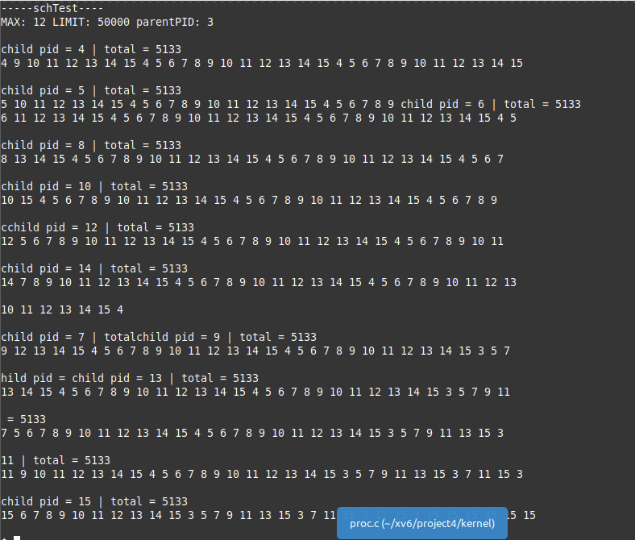
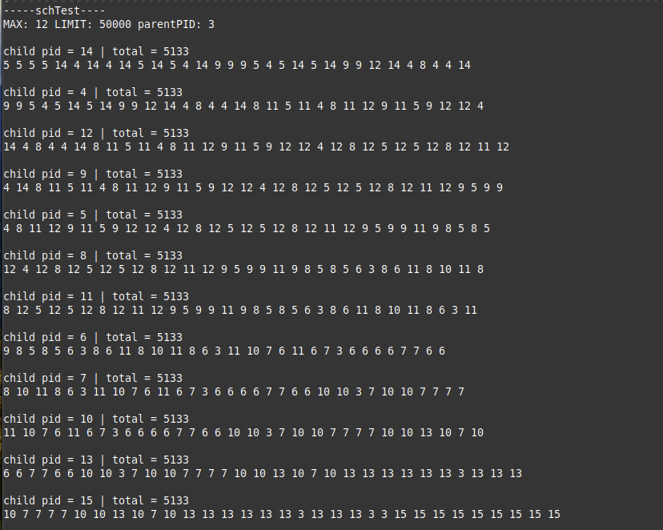

# Lottery Scheduler

## Overview
For this project, we were tasked with implementing a **Lottery Scheduler** within the xv6 operating system. Lottery scheduling is a probabilistic CPU scheduling algorithm where each process is assigned a number of lottery tickets. The CPU is then allocated to processes based on a random lottery draw, where the chances of a process being selected are proportional to the number of tickets it holds.

## Features
- Fair scheduling based on a random lottery system.
- Allows for varying priorities by assigning different amounts of tickets to processes.
- Demonstrates the behavior of a lottery scheduler in a controlled operating system environment.

## How It Works
1. Each process is given a certain number of lottery tickets.
2. The scheduler randomly draws a ticket, and the process holding the winning ticket gets to run.
3. Processes with more tickets have a higher probability of being selected, while processes with fewer tickets have a lower probability.

### Example
- Process A has 10 tickets.
- Process B has 20 tickets.
- Process C has 5 tickets.

In this case, Process B has the highest chance of winning the lottery and getting CPU time, while Process C has the lowest.

## Detailed walk through of my changes made to implement the lottery scheduler
###    1.) Update the PCB     2.)Update fork() system call     3.)Create setToken syscall 
- Added line to kernel/proc.h:   uint64 token;  
- Added line to kernel/proc.c: np->token = 1 
- Add line to user/user.h: int setToken(int token); // custom 
- Add line to user/usys.pl entry("setToken"); # custom 
- Add line to kernel/syscall.h: #define SYS_setToken 22 // custom 
- Add line to kernel/syscall.c: [SYS_setToken] sys_setToken, 
- Implement func in kernel/sysproc.c  
###    4.) Implement Lottery Scheduling  
Broke problem into three parts 
- STEP 1: Iterate over the list of processes in the proc array to compute the totalTokens  
- STEP 2: Generate a random number in the range [0, totalTokens] and save the orignal index for orientation in the circular array 
- STEP 3: Iterate over the proc array with a counting the number of tokens held by RUNNABLE processes and storing it in currentTokens 
###    5.) Implement schedDisp() syscall 
- Created kernel/schedInfo.h and defined struct of schedInfo 
- Included schedInfo.h in kernel/proc.c 
- Add line to kernel/proc.c: struct schedInfo schedInfos[32];// custom 
- Adjusted prcoInit to initialize the schdeInfo array's pid's to -1 
- Included a schedDisp() implementation on proc.c that called the syscall from sysproc. 
    Used copyout() to pass schedInfo to user space 
    Returned the schedIndex for orientation use in the circular array in schTest  
###    6.) Implement a user test program 
- Made a program called primeCount.c which utilizes the function primeCount() to count all the - Prime numbers between 2 and a passed value limit          	
- Made schTest.c 
    fork() MAX_PROCESS amount of children             
- The chlidren:              
    1.) Call primecount  
    2.)	Then they call schedDisp to retrive the last 32 processes and save the return value and use it to denote the front of the list 
    3.)	Finally for each iteration take the passedIndex and add the current iteration to get the index to access the pids in order             
- The parent:             
    wait(0)'s for all children to terminate before calling exit() on the initial process.   


## Screenshots
### Round-Robin Scheduler (Default) Execution Test
- Formatting had a propensity for jumbling up the print statements in the output 
- The array illustrates processes incrementing sequentially 



### Lottery Scheduler Execution Test
- The print statements display how processes in possession of more tokens get priority to run, however it is not guaranteed they will go first 
- The array displays more grouping as one process may execute multiple times because it wins the lottery in successive calls. 




## How to Run
1. Clone the repository:
    ```bash
    git clone https://github.com/yourusername/lottery-scheduler.git
    ```

2. Compile the xv6 OS and your scheduler modifications:
    ```bash
    make
    ```

3. Run xv6 with the scheduler:
    ```bash
    ./xv6
    ```

4. Test the lottery scheduler by executing the test program:
    ```bash
    schTest
    ```

## Project Details
This project is part of a course assignment for operating systems at my university and was developed as a custom CPU scheduling algorithm for the xv6 operating system.

The lottery scheduler is designed to demonstrate probabilistic scheduling methods in a simulated environment, offering insight into process management and scheduling algorithms. While this project is based on the xv6 OS, it serves as an educational tool rather than a production-level implementation.

## License
This project is licensed under the MIT License - see the [LICENSE](LICENSE) file for details.


# The Initial ReadMe and Full Acknowlgements for xv6:

xv6 is a re-implementation of Dennis Ritchie's and Ken Thompson's Unix
Version 6 (v6).  xv6 loosely follows the structure and style of v6,
but is implemented for a modern RISC-V multiprocessor using ANSI C.

ACKNOWLEDGMENTS

xv6 is inspired by John Lions's Commentary on UNIX 6th Edition (Peer
to Peer Communications; ISBN: 1-57398-013-7; 1st edition (June 14,
2000)).  See also https://pdos.csail.mit.edu/6.1810/, which provides
pointers to on-line resources for v6.

The following people have made contributions: Russ Cox (context switching,
locking), Cliff Frey (MP), Xiao Yu (MP), Nickolai Zeldovich, and Austin
Clements.

We are also grateful for the bug reports and patches contributed by
Takahiro Aoyagi, Silas Boyd-Wickizer, Anton Burtsev, carlclone, Ian
Chen, Dan Cross, Cody Cutler, Mike CAT, Tej Chajed, Asami Doi,
eyalz800, Nelson Elhage, Saar Ettinger, Alice Ferrazzi, Nathaniel
Filardo, flespark, Peter Froehlich, Yakir Goaron, Shivam Handa, Matt
Harvey, Bryan Henry, jaichenhengjie, Jim Huang, Matúš Jókay, John
Jolly, Alexander Kapshuk, Anders Kaseorg, kehao95, Wolfgang Keller,
Jungwoo Kim, Jonathan Kimmitt, Eddie Kohler, Vadim Kolontsov, Austin
Liew, l0stman, Pavan Maddamsetti, Imbar Marinescu, Yandong Mao, Matan
Shabtay, Hitoshi Mitake, Carmi Merimovich, Mark Morrissey, mtasm, Joel
Nider, Hayato Ohhashi, OptimisticSide, Harry Porter, Greg Price, Jude
Rich, segfault, Ayan Shafqat, Eldar Sehayek, Yongming Shen, Fumiya
Shigemitsu, Cam Tenny, tyfkda, Warren Toomey, Stephen Tu, Rafael Ubal,
Amane Uehara, Pablo Ventura, Xi Wang, WaheedHafez, Keiichi Watanabe,
Nicolas Wolovick, wxdao, Grant Wu, Jindong Zhang, Icenowy Zheng,
ZhUyU1997, and Zou Chang Wei.


The code in the files that constitute xv6 is
Copyright 2006-2022 Frans Kaashoek, Robert Morris, and Russ Cox.

ERROR REPORTS

Please send errors and suggestions to Frans Kaashoek and Robert Morris
(kaashoek,rtm@mit.edu).  The main purpose of xv6 is as a teaching
operating system for MIT's 6.1810, so we are more interested in
simplifications and clarifications than new features.

BUILDING AND RUNNING XV6

You will need a RISC-V "newlib" tool chain from
https://github.com/riscv/riscv-gnu-toolchain, and qemu compiled for
riscv64-softmmu.  Once they are installed, and in your shell
search path, you can run "make qemu".
